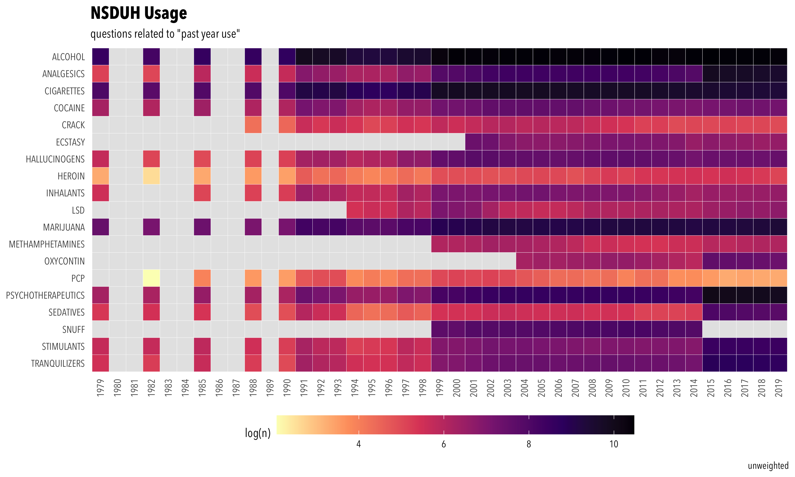

<!-- README.md is generated from README.Rmd. Please edit that file -->

```{r, include = FALSE}
knitr::opts_chunk$set(
  collapse = TRUE,
  comment = "#>"
)
```

This repository holds all data and code used for SOC 721S.

## plots

__Drug coverage:__

```{r, out.width="100%", echo=FALSE}
knitr::include_graphics("nsduh_coverage.png")
```

__Drug usage:__

```{r, out.width="100%", echo=FALSE}

```


Some of the proportions —especially around `2015`— might give misleading results if the question changes:

```{r, echo=FALSE, message=FALSE}
library(dplyr)
as.data.frame( readRDS("coverage.rds") ) %>% 
  filter(n >= 16) %>% 
  arrange(desc(description), desc(year))
```


## raw data

I'm not sharing the `raw_data` folder, which is quite heavy.

```{r}
sum(fs::file_size(dir("raw_data", full.names = TRUE, recursive = TRUE)))
```

And is structured like this:

```{r}
fs::dir_tree("raw_data")
```

