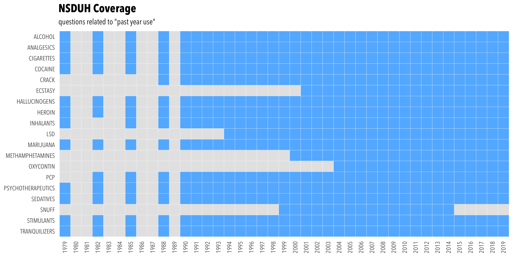

<!-- README.md is generated from README.Rmd. Please edit that file -->

This repository holds all data and code used for SOC 721S.

## plots

**Drug coverage:**



**Drug usage:**


Some of the proportions —especially around `2015`— might give misleading
results if the question changes:

    #>            var year        description  n
    #> 1     trqanyyr 2019      TRANQUILIZERS 34
    #> 2     trqanyyr 2018      TRANQUILIZERS 34
    #> 3     trqanyyr 2017      TRANQUILIZERS 34
    #> 4     trqanyyr 2016      TRANQUILIZERS 34
    #> 5     trqanyyr 2015      TRANQUILIZERS 34
    #> 6        trqyr 2014      TRANQUILIZERS 34
    #> 7        trqyr 2013      TRANQUILIZERS 34
    #> 8        trqyr 2012      TRANQUILIZERS 34
    #> 9        trqyr 2011      TRANQUILIZERS 34
    #> 10       trqyr 2010      TRANQUILIZERS 34
    #> 11       trqyr 2009      TRANQUILIZERS 34
    #> 12       trqyr 2008      TRANQUILIZERS 34
    #> 13       trqyr 2007      TRANQUILIZERS 34
    #> 14       trqyr 2006      TRANQUILIZERS 34
    #> 15       trqyr 2005      TRANQUILIZERS 34
    #> 16       trqyr 2004      TRANQUILIZERS 34
    #> 17       trqyr 2003      TRANQUILIZERS 34
    #> 18       trqyr 2002      TRANQUILIZERS 34
    #> 19       trqyr 2001      TRANQUILIZERS 34
    #> 20       trqyr 2000      TRANQUILIZERS 34
    #> 21       trqyr 1999      TRANQUILIZERS 34
    #> 22       trqyr 1998      TRANQUILIZERS 34
    #> 23       trqyr 1997      TRANQUILIZERS 34
    #> 24       trqyr 1996      TRANQUILIZERS 34
    #> 25       trqyr 1995      TRANQUILIZERS 34
    #> 26       trqyr 1994      TRANQUILIZERS 34
    #> 27       trqyr 1993      TRANQUILIZERS 34
    #> 28       trqyr 1992      TRANQUILIZERS 34
    #> 29       trqyr 1991      TRANQUILIZERS 34
    #> 30       trqyr 1990      TRANQUILIZERS 34
    #> 31       trqyr 1988      TRANQUILIZERS 34
    #> 32       trqyr 1985      TRANQUILIZERS 34
    #> 33       trqyr 1982      TRANQUILIZERS 34
    #> 34       trqyr 1979      TRANQUILIZERS 34
    #> 35    stmanyyr 2019         STIMULANTS 34
    #> 36    stmanyyr 2018         STIMULANTS 34
    #> 37    stmanyyr 2017         STIMULANTS 34
    #> 38    stmanyyr 2016         STIMULANTS 34
    #> 39    stmanyyr 2015         STIMULANTS 34
    #> 40       stmyr 2014         STIMULANTS 34
    #> 41       stmyr 2013         STIMULANTS 34
    #> 42       stmyr 2012         STIMULANTS 34
    #> 43       stmyr 2011         STIMULANTS 34
    #> 44       stmyr 2010         STIMULANTS 34
    #> 45       stmyr 2009         STIMULANTS 34
    #> 46       stmyr 2008         STIMULANTS 34
    #> 47       stmyr 2007         STIMULANTS 34
    #> 48       stmyr 2006         STIMULANTS 34
    #> 49       stmyr 2005         STIMULANTS 34
    #> 50       stmyr 2004         STIMULANTS 34
    #> 51       stmyr 2003         STIMULANTS 34
    #> 52       stmyr 2002         STIMULANTS 34
    #> 53       stmyr 2001         STIMULANTS 34
    #> 54       stmyr 2000         STIMULANTS 34
    #> 55       stmyr 1999         STIMULANTS 34
    #> 56       stmyr 1998         STIMULANTS 34
    #> 57       stmyr 1997         STIMULANTS 34
    #> 58       stmyr 1996         STIMULANTS 34
    #> 59       stmyr 1995         STIMULANTS 34
    #> 60       stmyr 1994         STIMULANTS 34
    #> 61       stmyr 1993         STIMULANTS 34
    #> 62       stmyr 1992         STIMULANTS 34
    #> 63       stmyr 1991         STIMULANTS 34
    #> 64       stmyr 1990         STIMULANTS 34
    #> 65       stmyr 1988         STIMULANTS 34
    #> 66       stmyr 1985         STIMULANTS 34
    #> 67       stmyr 1982         STIMULANTS 34
    #> 68       stmyr 1979         STIMULANTS 34
    #> 69       snfyr 2014              SNUFF 16
    #> 70       snfyr 2013              SNUFF 16
    #> 71       snfyr 2012              SNUFF 16
    #> 72       snfyr 2011              SNUFF 16
    #> 73       snfyr 2010              SNUFF 16
    #> 74       snfyr 2009              SNUFF 16
    #> 75       snfyr 2008              SNUFF 16
    #> 76       snfyr 2007              SNUFF 16
    #> 77       snfyr 2006              SNUFF 16
    #> 78       snfyr 2005              SNUFF 16
    #> 79       snfyr 2004              SNUFF 16
    #> 80       snfyr 2003              SNUFF 16
    #> 81       snfyr 2002              SNUFF 16
    #> 82       snfyr 2001              SNUFF 16
    #> 83       snfyr 2000              SNUFF 16
    #> 84       snfyr 1999              SNUFF 16
    #> 85    sedanyyr 2019          SEDATIVES 34
    #> 86    sedanyyr 2018          SEDATIVES 34
    #> 87    sedanyyr 2017          SEDATIVES 34
    #> 88    sedanyyr 2016          SEDATIVES 34
    #> 89    sedanyyr 2015          SEDATIVES 34
    #> 90       sedyr 2014          SEDATIVES 34
    #> 91       sedyr 2013          SEDATIVES 34
    #> 92       sedyr 2012          SEDATIVES 34
    #> 93       sedyr 2011          SEDATIVES 34
    #> 94       sedyr 2010          SEDATIVES 34
    #> 95       sedyr 2009          SEDATIVES 34
    #> 96       sedyr 2008          SEDATIVES 34
    #> 97       sedyr 2007          SEDATIVES 34
    #> 98       sedyr 2006          SEDATIVES 34
    #> 99       sedyr 2005          SEDATIVES 34
    #> 100      sedyr 2004          SEDATIVES 34
    #> 101      sedyr 2003          SEDATIVES 34
    #> 102      sedyr 2002          SEDATIVES 34
    #> 103      sedyr 2001          SEDATIVES 34
    #> 104      sedyr 2000          SEDATIVES 34
    #> 105      sedyr 1999          SEDATIVES 34
    #> 106      sedyr 1998          SEDATIVES 34
    #> 107      sedyr 1997          SEDATIVES 34
    #> 108      sedyr 1996          SEDATIVES 34
    #> 109      sedyr 1995          SEDATIVES 34
    #> 110      sedyr 1994          SEDATIVES 34
    #> 111      sedyr 1993          SEDATIVES 34
    #> 112      sedyr 1992          SEDATIVES 34
    #> 113      sedyr 1991          SEDATIVES 34
    #> 114      sedyr 1990          SEDATIVES 34
    #> 115      sedyr 1988          SEDATIVES 34
    #> 116      sedyr 1985          SEDATIVES 34
    #> 117      sedyr 1982          SEDATIVES 34
    #> 118      sedyr 1979          SEDATIVES 34
    #> 119   psyanyyr 2019 PSYCHOTHERAPEUTICS 34
    #> 120   psyanyyr 2018 PSYCHOTHERAPEUTICS 34
    #> 121   psyanyyr 2017 PSYCHOTHERAPEUTICS 34
    #> 122   psyanyyr 2016 PSYCHOTHERAPEUTICS 34
    #> 123   psyanyyr 2015 PSYCHOTHERAPEUTICS 34
    #> 124     psyyr2 2014 PSYCHOTHERAPEUTICS 34
    #> 125     psyyr2 2013 PSYCHOTHERAPEUTICS 34
    #> 126     psyyr2 2012 PSYCHOTHERAPEUTICS 34
    #> 127     psyyr2 2011 PSYCHOTHERAPEUTICS 34
    #> 128     psyyr2 2010 PSYCHOTHERAPEUTICS 34
    #> 129     psyyr2 2009 PSYCHOTHERAPEUTICS 34
    #> 130     psyyr2 2008 PSYCHOTHERAPEUTICS 34
    #> 131     psyyr2 2007 PSYCHOTHERAPEUTICS 34
    #> 132     psyyr2 2006 PSYCHOTHERAPEUTICS 34
    #> 133     psyyr2 2005 PSYCHOTHERAPEUTICS 34
    #> 134     psyyr2 2004 PSYCHOTHERAPEUTICS 34
    #> 135     psyyr2 2003 PSYCHOTHERAPEUTICS 34
    #> 136     psyyr2 2002 PSYCHOTHERAPEUTICS 34
    #> 137     psyyr2 2001 PSYCHOTHERAPEUTICS 34
    #> 138     psyyr2 2000 PSYCHOTHERAPEUTICS 34
    #> 139     psyyr2 1999 PSYCHOTHERAPEUTICS 34
    #> 140     psyyr2 1998 PSYCHOTHERAPEUTICS 34
    #> 141     psyyr2 1997 PSYCHOTHERAPEUTICS 34
    #> 142     psyyr2 1996 PSYCHOTHERAPEUTICS 34
    #> 143     psyyr2 1995 PSYCHOTHERAPEUTICS 34
    #> 144     psyyr2 1994 PSYCHOTHERAPEUTICS 34
    #> 145     psyyr2 1993 PSYCHOTHERAPEUTICS 34
    #> 146     psyyr2 1992 PSYCHOTHERAPEUTICS 34
    #> 147     psyyr2 1991 PSYCHOTHERAPEUTICS 34
    #> 148     psyyr2 1990 PSYCHOTHERAPEUTICS 34
    #> 149     psyyr2 1988 PSYCHOTHERAPEUTICS 34
    #> 150     psyyr2 1985 PSYCHOTHERAPEUTICS 34
    #> 151     psyyr2 1982 PSYCHOTHERAPEUTICS 34
    #> 152     psyyr2 1979 PSYCHOTHERAPEUTICS 34
    #> 153      pcpyr 2019                PCP 33
    #> 154      pcpyr 2018                PCP 33
    #> 155      pcpyr 2017                PCP 33
    #> 156      pcpyr 2016                PCP 33
    #> 157      pcpyr 2015                PCP 33
    #> 158      pcpyr 2014                PCP 33
    #> 159      pcpyr 2013                PCP 33
    #> 160      pcpyr 2012                PCP 33
    #> 161      pcpyr 2011                PCP 33
    #> 162      pcpyr 2010                PCP 33
    #> 163      pcpyr 2009                PCP 33
    #> 164      pcpyr 2008                PCP 33
    #> 165      pcpyr 2007                PCP 33
    #> 166      pcpyr 2006                PCP 33
    #> 167      pcpyr 2005                PCP 33
    #> 168      pcpyr 2004                PCP 33
    #> 169      pcpyr 2003                PCP 33
    #> 170      pcpyr 2002                PCP 33
    #> 171      pcpyr 2001                PCP 33
    #> 172      pcpyr 2000                PCP 33
    #> 173      pcpyr 1999                PCP 33
    #> 174      pcpyr 1998                PCP 33
    #> 175      pcpyr 1997                PCP 33
    #> 176      pcpyr 1996                PCP 33
    #> 177      pcpyr 1995                PCP 33
    #> 178      pcpyr 1994                PCP 33
    #> 179      pcpyr 1993                PCP 33
    #> 180      pcpyr 1992                PCP 33
    #> 181      pcpyr 1991                PCP 33
    #> 182      pcpyr 1990                PCP 33
    #> 183      pcpyr 1988                PCP 33
    #> 184      pcpyr 1985                PCP 33
    #> 185     pcpyrx 1982                PCP 33
    #> 186 oxycnanyyr 2019          OXYCONTIN 16
    #> 187 oxycnanyyr 2018          OXYCONTIN 16
    #> 188 oxycnanyyr 2017          OXYCONTIN 16
    #> 189 oxycnanyyr 2016          OXYCONTIN 16
    #> 190 oxycnanyyr 2015          OXYCONTIN 16
    #> 191      oxyyr 2014          OXYCONTIN 16
    #> 192      oxyyr 2013          OXYCONTIN 16
    #> 193      oxyyr 2012          OXYCONTIN 16
    #> 194      oxyyr 2011          OXYCONTIN 16
    #> 195      oxyyr 2010          OXYCONTIN 16
    #> 196      oxyyr 2009          OXYCONTIN 16
    #> 197      oxyyr 2008          OXYCONTIN 16
    #> 198      oxyyr 2007          OXYCONTIN 16
    #> 199      oxyyr 2006          OXYCONTIN 16
    #> 200      oxyyr 2005          OXYCONTIN 16
    #> 201      oxyyr 2004          OXYCONTIN 16
    #> 202   methamyr 2019   METHAMPHETAMINES 21
    #> 203   methamyr 2018   METHAMPHETAMINES 21
    #> 204   methamyr 2017   METHAMPHETAMINES 21
    #> 205   methamyr 2016   METHAMPHETAMINES 21
    #> 206   methamyr 2015   METHAMPHETAMINES 21
    #> 207      mthyr 2014   METHAMPHETAMINES 21
    #> 208      mthyr 2013   METHAMPHETAMINES 21
    #> 209      mthyr 2012   METHAMPHETAMINES 21
    #> 210      mthyr 2011   METHAMPHETAMINES 21
    #> 211      mthyr 2010   METHAMPHETAMINES 21
    #> 212      mthyr 2009   METHAMPHETAMINES 21
    #> 213      mthyr 2008   METHAMPHETAMINES 21
    #> 214      mthyr 2007   METHAMPHETAMINES 21
    #> 215      mthyr 2006   METHAMPHETAMINES 21
    #> 216      mthyr 2005   METHAMPHETAMINES 21
    #> 217      mthyr 2004   METHAMPHETAMINES 21
    #> 218      mthyr 2003   METHAMPHETAMINES 21
    #> 219      mthyr 2002   METHAMPHETAMINES 21
    #> 220      mthyr 2001   METHAMPHETAMINES 21
    #> 221      mthyr 2000   METHAMPHETAMINES 21
    #> 222     mthmon 1999   METHAMPHETAMINES 21
    #> 223      mrjyr 2019          MARIJUANA 34
    #> 224      mrjyr 2018          MARIJUANA 34
    #> 225      mrjyr 2017          MARIJUANA 34
    #> 226      mrjyr 2016          MARIJUANA 34
    #> 227      mrjyr 2015          MARIJUANA 34
    #> 228      mrjyr 2014          MARIJUANA 34
    #> 229      mrjyr 2013          MARIJUANA 34
    #> 230      mrjyr 2012          MARIJUANA 34
    #> 231      mrjyr 2011          MARIJUANA 34
    #> 232      mrjyr 2010          MARIJUANA 34
    #> 233      mrjyr 2009          MARIJUANA 34
    #> 234      mrjyr 2008          MARIJUANA 34
    #> 235      mrjyr 2007          MARIJUANA 34
    #> 236      mrjyr 2006          MARIJUANA 34
    #> 237      mrjyr 2005          MARIJUANA 34
    #> 238      mrjyr 2004          MARIJUANA 34
    #> 239      mrjyr 2003          MARIJUANA 34
    #> 240      mrjyr 2002          MARIJUANA 34
    #> 241      mrjyr 2001          MARIJUANA 34
    #> 242      mrjyr 2000          MARIJUANA 34
    #> 243      mrjyr 1999          MARIJUANA 34
    #> 244      mrjyr 1998          MARIJUANA 34
    #> 245      mrjyr 1997          MARIJUANA 34
    #> 246      mrjyr 1996          MARIJUANA 34
    #> 247      mrjyr 1995          MARIJUANA 34
    #> 248      mrjyr 1994          MARIJUANA 34
    #> 249      mrjyr 1993          MARIJUANA 34
    #> 250      mrjyr 1992          MARIJUANA 34
    #> 251      mrjyr 1991          MARIJUANA 34
    #> 252      mrjyr 1990          MARIJUANA 34
    #> 253      mrjyr 1988          MARIJUANA 34
    #> 254      mrjyr 1985          MARIJUANA 34
    #> 255      mrjyr 1982          MARIJUANA 34
    #> 256      mrjyr 1979          MARIJUANA 34
    #> 257      lsdyr 2019                LSD 26
    #> 258      lsdyr 2018                LSD 26
    #> 259      lsdyr 2017                LSD 26
    #> 260      lsdyr 2016                LSD 26
    #> 261      lsdyr 2015                LSD 26
    #> 262      lsdyr 2014                LSD 26
    #> 263      lsdyr 2013                LSD 26
    #> 264      lsdyr 2012                LSD 26
    #> 265      lsdyr 2011                LSD 26
    #> 266      lsdyr 2010                LSD 26
    #> 267      lsdyr 2009                LSD 26
    #> 268      lsdyr 2008                LSD 26
    #> 269      lsdyr 2007                LSD 26
    #> 270      lsdyr 2006                LSD 26
    #> 271      lsdyr 2005                LSD 26
    #> 272      lsdyr 2004                LSD 26
    #> 273      lsdyr 2003                LSD 26
    #> 274      lsdyr 2002                LSD 26
    #> 275      lsdyr 2001                LSD 26
    #> 276      lsdyr 2000                LSD 26
    #> 277      lsdyr 1999                LSD 26
    #> 278      lsdyr 1998                LSD 26
    #> 279      lsdyr 1997                LSD 26
    #> 280      lsdyr 1996                LSD 26
    #> 281      lsdyr 1995                LSD 26
    #> 282      lsdyr 1994                LSD 26
    #> 283    inhalyr 2019          INHALANTS 33
    #> 284    inhalyr 2018          INHALANTS 33
    #> 285    inhalyr 2017          INHALANTS 33
    #> 286    inhalyr 2016          INHALANTS 33
    #> 287    inhalyr 2015          INHALANTS 33
    #> 288      inhyr 2014          INHALANTS 33
    #> 289      inhyr 2013          INHALANTS 33
    #> 290      inhyr 2012          INHALANTS 33
    #> 291      inhyr 2011          INHALANTS 33
    #> 292      inhyr 2010          INHALANTS 33
    #> 293      inhyr 2009          INHALANTS 33
    #> 294      inhyr 2008          INHALANTS 33
    #> 295      inhyr 2007          INHALANTS 33
    #> 296      inhyr 2006          INHALANTS 33
    #> 297      inhyr 2005          INHALANTS 33
    #> 298      inhyr 2004          INHALANTS 33
    #> 299      inhyr 2003          INHALANTS 33
    #> 300      inhyr 2002          INHALANTS 33
    #> 301      inhyr 2001          INHALANTS 33
    #> 302      inhyr 2000          INHALANTS 33
    #> 303      inhyr 1999          INHALANTS 33
    #> 304      inhyr 1998          INHALANTS 33
    #> 305      inhyr 1997          INHALANTS 33
    #> 306      inhyr 1996          INHALANTS 33
    #> 307      inhyr 1995          INHALANTS 33
    #> 308      inhyr 1994          INHALANTS 33
    #> 309      inhyr 1993          INHALANTS 33
    #> 310      inhyr 1992          INHALANTS 33
    #> 311      inhyr 1991          INHALANTS 33
    #> 312      inhyr 1990          INHALANTS 33
    #> 313      inhyr 1988          INHALANTS 33
    #> 314      inhyr 1985          INHALANTS 33
    #> 315      inhyr 1979          INHALANTS 33
    #> 316      heryr 2019             HEROIN 34
    #> 317      heryr 2018             HEROIN 34
    #> 318      heryr 2017             HEROIN 34
    #> 319      heryr 2016             HEROIN 34
    #> 320      heryr 2015             HEROIN 34
    #> 321      heryr 2014             HEROIN 34
    #> 322      heryr 2013             HEROIN 34
    #> 323      heryr 2012             HEROIN 34
    #> 324      heryr 2011             HEROIN 34
    #> 325      heryr 2010             HEROIN 34
    #> 326      heryr 2009             HEROIN 34
    #> 327      heryr 2008             HEROIN 34
    #> 328      heryr 2007             HEROIN 34
    #> 329      heryr 2006             HEROIN 34
    #> 330      heryr 2005             HEROIN 34
    #> 331      heryr 2004             HEROIN 34
    #> 332      heryr 2003             HEROIN 34
    #> 333      heryr 2002             HEROIN 34
    #> 334      heryr 2001             HEROIN 34
    #> 335      heryr 2000             HEROIN 34
    #> 336      heryr 1999             HEROIN 34
    #> 337      heryr 1998             HEROIN 34
    #> 338      heryr 1997             HEROIN 34
    #> 339      heryr 1996             HEROIN 34
    #> 340      heryr 1995             HEROIN 34
    #> 341      heryr 1994             HEROIN 34
    #> 342      heryr 1993             HEROIN 34
    #> 343      heryr 1992             HEROIN 34
    #> 344      heryr 1991             HEROIN 34
    #> 345      heryr 1990             HEROIN 34
    #> 346      heryr 1988             HEROIN 34
    #> 347      heryr 1985             HEROIN 34
    #> 348      heryr 1982             HEROIN 34
    #> 349      heryr 1979             HEROIN 34
    #> 350   hallucyr 2019      HALLUCINOGENS 34
    #> 351   hallucyr 2018      HALLUCINOGENS 34
    #> 352   hallucyr 2017      HALLUCINOGENS 34
    #> 353   hallucyr 2016      HALLUCINOGENS 34
    #> 354   hallucyr 2015      HALLUCINOGENS 34
    #> 355      halyr 2014      HALLUCINOGENS 34
    #> 356      halyr 2013      HALLUCINOGENS 34
    #> 357      halyr 2012      HALLUCINOGENS 34
    #> 358      halyr 2011      HALLUCINOGENS 34
    #> 359      halyr 2010      HALLUCINOGENS 34
    #> 360      halyr 2009      HALLUCINOGENS 34
    #> 361      halyr 2008      HALLUCINOGENS 34
    #> 362      halyr 2007      HALLUCINOGENS 34
    #> 363      halyr 2006      HALLUCINOGENS 34
    #> 364      halyr 2005      HALLUCINOGENS 34
    #> 365      halyr 2004      HALLUCINOGENS 34
    #> 366      halyr 2003      HALLUCINOGENS 34
    #> 367      halyr 2002      HALLUCINOGENS 34
    #> 368      halyr 2001      HALLUCINOGENS 34
    #> 369      halyr 2000      HALLUCINOGENS 34
    #> 370      halyr 1999      HALLUCINOGENS 34
    #> 371      halyr 1998      HALLUCINOGENS 34
    #> 372      halyr 1997      HALLUCINOGENS 34
    #> 373      halyr 1996      HALLUCINOGENS 34
    #> 374      halyr 1995      HALLUCINOGENS 34
    #> 375      halyr 1994      HALLUCINOGENS 34
    #> 376      halyr 1993      HALLUCINOGENS 34
    #> 377      halyr 1992      HALLUCINOGENS 34
    #> 378      halyr 1991      HALLUCINOGENS 34
    #> 379      halyr 1990      HALLUCINOGENS 34
    #> 380      halyr 1988      HALLUCINOGENS 34
    #> 381      halyr 1985      HALLUCINOGENS 34
    #> 382      halyr 1982      HALLUCINOGENS 34
    #> 383      halyr 1979      HALLUCINOGENS 34
    #> 384   ecstmoyr 2019            ECSTASY 19
    #> 385   ecstmoyr 2018            ECSTASY 19
    #> 386   ecstmoyr 2017            ECSTASY 19
    #> 387   ecstmoyr 2016            ECSTASY 19
    #> 388   ecstmoyr 2015            ECSTASY 19
    #> 389      ecsyr 2014            ECSTASY 19
    #> 390      ecsyr 2013            ECSTASY 19
    #> 391      ecsyr 2012            ECSTASY 19
    #> 392      ecsyr 2011            ECSTASY 19
    #> 393      ecsyr 2010            ECSTASY 19
    #> 394      ecsyr 2009            ECSTASY 19
    #> 395      ecsyr 2008            ECSTASY 19
    #> 396      ecsyr 2007            ECSTASY 19
    #> 397      ecsyr 2006            ECSTASY 19
    #> 398      ecsyr 2005            ECSTASY 19
    #> 399      ecsyr 2004            ECSTASY 19
    #> 400      ecsyr 2003            ECSTASY 19
    #> 401      ecsyr 2002            ECSTASY 19
    #> 402      ecsyr 2001            ECSTASY 19
    #> 403      crkyr 2019              CRACK 31
    #> 404      crkyr 2018              CRACK 31
    #> 405      crkyr 2017              CRACK 31
    #> 406      crkyr 2016              CRACK 31
    #> 407      crkyr 2015              CRACK 31
    #> 408      crkyr 2014              CRACK 31
    #> 409      crkyr 2013              CRACK 31
    #> 410      crkyr 2012              CRACK 31
    #> 411      crkyr 2011              CRACK 31
    #> 412      crkyr 2010              CRACK 31
    #> 413      crkyr 2009              CRACK 31
    #> 414      crkyr 2008              CRACK 31
    #> 415      crkyr 2007              CRACK 31
    #> 416      crkyr 2006              CRACK 31
    #> 417      crkyr 2005              CRACK 31
    #> 418      crkyr 2004              CRACK 31
    #> 419      crkyr 2003              CRACK 31
    #> 420      crkyr 2002              CRACK 31
    #> 421      crkyr 2001              CRACK 31
    #> 422      crkyr 2000              CRACK 31
    #> 423      crkyr 1999              CRACK 31
    #> 424      crkyr 1998              CRACK 31
    #> 425      crkyr 1997              CRACK 31
    #> 426      crkyr 1996              CRACK 31
    #> 427      crkyr 1995              CRACK 31
    #> 428      crkyr 1994              CRACK 31
    #> 429      crkyr 1993              CRACK 31
    #> 430      crkyr 1992              CRACK 31
    #> 431      crkyr 1991              CRACK 31
    #> 432      crkyr 1990              CRACK 31
    #> 433      crkyr 1988              CRACK 31
    #> 434      cocyr 2019            COCAINE 34
    #> 435      cocyr 2018            COCAINE 34
    #> 436      cocyr 2017            COCAINE 34
    #> 437      cocyr 2016            COCAINE 34
    #> 438      cocyr 2015            COCAINE 34
    #> 439      cocyr 2014            COCAINE 34
    #> 440      cocyr 2013            COCAINE 34
    #> 441      cocyr 2012            COCAINE 34
    #> 442      cocyr 2011            COCAINE 34
    #> 443      cocyr 2010            COCAINE 34
    #> 444      cocyr 2009            COCAINE 34
    #> 445      cocyr 2008            COCAINE 34
    #> 446      cocyr 2007            COCAINE 34
    #> 447      cocyr 2006            COCAINE 34
    #> 448      cocyr 2005            COCAINE 34
    #> 449      cocyr 2004            COCAINE 34
    #> 450      cocyr 2003            COCAINE 34
    #> 451      cocyr 2002            COCAINE 34
    #> 452      cocyr 2001            COCAINE 34
    #> 453      cocyr 2000            COCAINE 34
    #> 454      cocyr 1999            COCAINE 34
    #> 455      cocyr 1998            COCAINE 34
    #> 456      cocyr 1997            COCAINE 34
    #> 457      cocyr 1996            COCAINE 34
    #> 458      cocyr 1995            COCAINE 34
    #> 459      cocyr 1994            COCAINE 34
    #> 460      cocyr 1993            COCAINE 34
    #> 461      cocyr 1992            COCAINE 34
    #> 462      cocyr 1991            COCAINE 34
    #> 463      cocyr 1990            COCAINE 34
    #> 464      cocyr 1988            COCAINE 34
    #> 465      cocyr 1985            COCAINE 34
    #> 466      cocyr 1982            COCAINE 34
    #> 467      cocyr 1979            COCAINE 34
    #> 468      cigyr 2019         CIGARETTES 34
    #> 469      cigyr 2018         CIGARETTES 34
    #> 470      cigyr 2017         CIGARETTES 34
    #> 471      cigyr 2016         CIGARETTES 34
    #> 472      cigyr 2015         CIGARETTES 34
    #> 473      cigyr 2014         CIGARETTES 34
    #> 474      cigyr 2013         CIGARETTES 34
    #> 475      cigyr 2012         CIGARETTES 34
    #> 476      cigyr 2011         CIGARETTES 34
    #> 477      cigyr 2010         CIGARETTES 34
    #> 478      cigyr 2009         CIGARETTES 34
    #> 479      cigyr 2008         CIGARETTES 34
    #> 480      cigyr 2007         CIGARETTES 34
    #> 481      cigyr 2006         CIGARETTES 34
    #> 482      cigyr 2005         CIGARETTES 34
    #> 483      cigyr 2004         CIGARETTES 34
    #> 484      cigyr 2003         CIGARETTES 34
    #> 485      cigyr 2002         CIGARETTES 34
    #> 486      cigyr 2001         CIGARETTES 34
    #> 487      cigyr 2000         CIGARETTES 34
    #> 488      cigyr 1999         CIGARETTES 34
    #> 489      cigyr 1998         CIGARETTES 34
    #> 490      cigyr 1997         CIGARETTES 34
    #> 491      cigyr 1996         CIGARETTES 34
    #> 492      cigyr 1995         CIGARETTES 34
    #> 493      cigyr 1994         CIGARETTES 34
    #> 494      cigyr 1993         CIGARETTES 34
    #> 495      cigyr 1992         CIGARETTES 34
    #> 496      cigyr 1991         CIGARETTES 34
    #> 497      cigyr 1990         CIGARETTES 34
    #> 498      cigyr 1988         CIGARETTES 34
    #> 499      cigyr 1985         CIGARETTES 34
    #> 500      cigyr 1982         CIGARETTES 34
    #> 501      cigyr 1979         CIGARETTES 34
    #> 502   pnranyyr 2019         ANALGESICS 34
    #> 503   pnranyyr 2018         ANALGESICS 34
    #> 504   pnranyyr 2017         ANALGESICS 34
    #> 505   pnranyyr 2016         ANALGESICS 34
    #> 506   pnranyyr 2015         ANALGESICS 34
    #> 507      anlyr 2014         ANALGESICS 34
    #> 508      anlyr 2013         ANALGESICS 34
    #> 509      anlyr 2012         ANALGESICS 34
    #> 510      anlyr 2011         ANALGESICS 34
    #> 511      anlyr 2010         ANALGESICS 34
    #> 512      anlyr 2009         ANALGESICS 34
    #> 513      anlyr 2008         ANALGESICS 34
    #> 514      anlyr 2007         ANALGESICS 34
    #> 515      anlyr 2006         ANALGESICS 34
    #> 516      anlyr 2005         ANALGESICS 34
    #> 517      anlyr 2004         ANALGESICS 34
    #> 518      anlyr 2003         ANALGESICS 34
    #> 519      anlyr 2002         ANALGESICS 34
    #> 520      anlyr 2001         ANALGESICS 34
    #> 521      anlyr 2000         ANALGESICS 34
    #> 522      anlyr 1999         ANALGESICS 34
    #> 523      anlyr 1998         ANALGESICS 34
    #> 524      anlyr 1997         ANALGESICS 34
    #> 525      anlyr 1996         ANALGESICS 34
    #> 526      anlyr 1995         ANALGESICS 34
    #> 527      anlyr 1994         ANALGESICS 34
    #> 528      anlyr 1993         ANALGESICS 34
    #> 529      anlyr 1992         ANALGESICS 34
    #> 530      anlyr 1991         ANALGESICS 34
    #> 531      anlyr 1990         ANALGESICS 34
    #> 532      anlyr 1988         ANALGESICS 34
    #> 533      anlyr 1985         ANALGESICS 34
    #> 534      anlyr 1982         ANALGESICS 34
    #> 535      anlyr 1979         ANALGESICS 34
    #> 536      alcyr 2019            ALCOHOL 34
    #> 537      alcyr 2018            ALCOHOL 34
    #> 538      alcyr 2017            ALCOHOL 34
    #> 539      alcyr 2016            ALCOHOL 34
    #> 540      alcyr 2015            ALCOHOL 34
    #> 541      alcyr 2014            ALCOHOL 34
    #> 542      alcyr 2013            ALCOHOL 34
    #> 543      alcyr 2012            ALCOHOL 34
    #> 544      alcyr 2011            ALCOHOL 34
    #> 545      alcyr 2010            ALCOHOL 34
    #> 546      alcyr 2009            ALCOHOL 34
    #> 547      alcyr 2008            ALCOHOL 34
    #> 548      alcyr 2007            ALCOHOL 34
    #> 549      alcyr 2006            ALCOHOL 34
    #> 550      alcyr 2005            ALCOHOL 34
    #> 551      alcyr 2004            ALCOHOL 34
    #> 552      alcyr 2003            ALCOHOL 34
    #> 553      alcyr 2002            ALCOHOL 34
    #> 554      alcyr 2001            ALCOHOL 34
    #> 555      alcyr 2000            ALCOHOL 34
    #> 556      alcyr 1999            ALCOHOL 34
    #> 557      alcyr 1998            ALCOHOL 34
    #> 558      alcyr 1997            ALCOHOL 34
    #> 559      alcyr 1996            ALCOHOL 34
    #> 560      alcyr 1995            ALCOHOL 34
    #> 561      alcyr 1994            ALCOHOL 34
    #> 562      alcyr 1993            ALCOHOL 34
    #> 563      alcyr 1992            ALCOHOL 34
    #> 564      alcyr 1991            ALCOHOL 34
    #> 565      alcyr 1990            ALCOHOL 34
    #> 566      alcyr 1988            ALCOHOL 34
    #> 567      alcyr 1985            ALCOHOL 34
    #> 568      alcyr 1982            ALCOHOL 34
    #> 569      alcyr 1979            ALCOHOL 34

## raw data

I’m not sharing the `raw_data` folder, which is quite heavy.

``` r
sum(fs::file_size(dir("raw_data", full.names = TRUE, recursive = TRUE)))
#> 5.01G
```

And is structured like this:

``` r
fs::dir_tree("raw_data")
#> raw_data
#> ├── 1979
#> │   ├── NHSDA-1979-DS0001-bndl-data-stata.zip
#> │   ├── NHSDA-1979-DS0001-data-stata-supplemental-syntax.do
#> │   ├── NHSDA-1979-DS0001-data-stata.dta
#> │   └── NHSDA-1979-DS0001-info-codebook.pdf
#> ├── 1982
#> │   ├── NHSDA-1982-DS0001-bndl-data-stata.zip
#> │   ├── NHSDA-1982-DS0001-data-stata-supplemental-syntax.do
#> │   ├── NHSDA-1982-DS0001-data-stata.dta
#> │   └── NHSDA-1982-DS0001-info-codebook.pdf
#> ├── 1985
#> │   ├── NHSDA-1985-DS0001-bndl-data-stata.zip
#> │   ├── NHSDA-1985-DS0001-data-stata-supplemental-syntax.do
#> │   ├── NHSDA-1985-DS0001-data-stata.dta
#> │   └── NHSDA-1985-DS0001-info-codebook.pdf
#> ├── 1988
#> │   ├── NHSDA-1988-DS0001-bndl-data-stata.zip
#> │   ├── NHSDA-1988-DS0001-data-stata-supplemental-syntax.do
#> │   ├── NHSDA-1988-DS0001-data-stata.dta
#> │   └── NHSDA-1988-DS0001-info-codebook.pdf
#> ├── 1990
#> │   ├── NHSDA-1990-DS0001-bndl-data-stata.zip
#> │   ├── NHSDA-1990-DS0001-data-stata-supplemental-syntax.do
#> │   ├── NHSDA-1990-DS0001-data-stata.dta
#> │   └── NHSDA-1990-DS0001-info-codebook.pdf
#> ├── 1991
#> │   ├── NHSDA-1991-DS0001-bndl-data-stata.zip
#> │   ├── NHSDA-1991-DS0001-data-stata-supplemental-syntax.do
#> │   ├── NHSDA-1991-DS0001-data-stata.dta
#> │   └── NHSDA-1991-DS0001-info-codebook.pdf
#> ├── 1992
#> │   ├── NHSDA-1992-DS0001-bndl-data-stata.zip
#> │   ├── NHSDA-1992-DS0001-data-stata-supplemental-syntax.do
#> │   ├── NHSDA-1992-DS0001-data-stata.dta
#> │   └── NHSDA-1992-DS0001-info-codebook.pdf
#> ├── 1993
#> │   ├── NHSDA-1993-DS0001-bndl-data-stata.zip
#> │   ├── NHSDA-1993-DS0001-data-stata-supplemental-syntax.do
#> │   ├── NHSDA-1993-DS0001-data-stata.dta
#> │   └── NHSDA-1993-DS0001-info-codebook.pdf
#> ├── 1994
#> │   ├── NHSDA-1994-DS0001-bndl-data-stata.zip
#> │   ├── NHSDA-1994-DS0001-data-stata-supplemental-syntax.do
#> │   ├── NHSDA-1994-DS0001-data-stata.dta
#> │   ├── NHSDA-1994-DS0001-info-codebook.pdf
#> │   ├── NHSDA-1994-DS0002-bndl-data-stata.zip
#> │   ├── NHSDA-1994-DS0002-data-stata-supplemental-syntax.do
#> │   ├── NHSDA-1994-DS0002-data-stata.dta
#> │   └── NHSDA-1994-DS0002-info-codebook.pdf
#> ├── 1995
#> │   ├── NHSDA-1995-DS0001-bndl-data-stata.zip
#> │   ├── NHSDA-1995-DS0001-data-stata-supplemental-syntax.do
#> │   ├── NHSDA-1995-DS0001-data-stata.dta
#> │   └── NHSDA-1995-DS0001-info-codebook.pdf
#> ├── 1996
#> │   ├── NHSDA-1996-DS0001-bndl-data-stata.zip
#> │   ├── NHSDA-1996-DS0001-data-stata-supplemental-syntax.do
#> │   ├── NHSDA-1996-DS0001-data-stata.dta
#> │   └── NHSDA-1996-DS0001-info-codebook.pdf
#> ├── 1997
#> │   ├── NHSDA-1997-DS0001-bndl-data-stata.zip
#> │   ├── NHSDA-1997-DS0001-data-stata-supplemental-syntax.do
#> │   ├── NHSDA-1997-DS0001-data-stata.dta
#> │   └── NHSDA-1997-DS0001-info-codebook.pdf
#> ├── 1998
#> │   ├── NHSDA-1998-DS0001-bndl-data-stata.zip
#> │   ├── NHSDA-1998-DS0001-data-stata-supplemental-syntax.do
#> │   ├── NHSDA-1998-DS0001-data-stata.dta
#> │   └── NHSDA-1998-DS0001-info-codebook.pdf
#> ├── 1999
#> │   ├── NHSDA-1999-DS0001-bndl-data-stata.zip
#> │   ├── NHSDA-1999-DS0001-data-stata-supplemental-syntax.do
#> │   ├── NHSDA-1999-DS0001-data-stata.dta
#> │   └── NHSDA-1999-DS0001-info-codebook.pdf
#> ├── 2000
#> │   ├── NHSDA-2000-DS0001-bndl-data-stata.zip
#> │   ├── NHSDA-2000-DS0001-data-stata-supplemental-syntax.do
#> │   ├── NHSDA-2000-DS0001-data-stata.dta
#> │   └── NHSDA-2000-DS0001-info-codebook.pdf
#> ├── 2001
#> │   ├── NHSDA-2001-DS0001-bndl-data-stata.zip
#> │   ├── NHSDA-2001-DS0001-data-stata-supplemental-syntax.do
#> │   ├── NHSDA-2001-DS0001-data-stata.dta
#> │   └── NHSDA-2001-DS0001-info-codebook.pdf
#> ├── 2002
#> │   ├── NSDUH-2002-DS0001-bndl-data-stata.zip
#> │   ├── NSDUH-2002-DS0001-info-codebook.pdf
#> │   ├── NSDUH-2002-data-stata-supplemental-syntax.do
#> │   └── NSDUH_2002.DTA
#> ├── 2003
#> │   ├── NSDUH-2003-DS0001-bndl-data-stata.zip
#> │   ├── NSDUH-2003-DS0001-info-codebook.pdf
#> │   ├── NSDUH-2003-data-stata-supplemental-syntax.do
#> │   └── NSDUH_2003.DTA
#> ├── 2004
#> │   ├── NSDUH-2004-DS0001-bndl-data-stata.zip
#> │   ├── NSDUH-2004-DS0001-info-codebook.pdf
#> │   ├── NSDUH-2004-data-stata-supplemental-syntax.do
#> │   └── NSDUH_2004.DTA
#> ├── 2005
#> │   ├── NSDUH-2005-DS0001-bndl-data-stata.zip
#> │   ├── NSDUH-2005-DS0001-info-codebook.pdf
#> │   ├── NSDUH-2005-data-stata-supplemental-syntax.do
#> │   └── NSDUH_2005.DTA
#> ├── 2006
#> │   ├── NSDUH-2006-DS0001-bndl-data-stata.zip
#> │   ├── NSDUH-2006-DS0001-info-codebook.pdf
#> │   ├── NSDUH-2006-data-stata-supplemental-syntax.do
#> │   └── NSDUH_2006.DTA
#> ├── 2007
#> │   ├── NSDUH-2007-DS0001-bndl-data-stata.zip
#> │   ├── NSDUH-2007-DS0001-info-codebook.pdf
#> │   ├── NSDUH-2007-data-stata-supplemental-syntax.do
#> │   └── NSDUH_2007.DTA
#> ├── 2008
#> │   ├── NSDUH-2008-DS0001-bndl-data-stata.zip
#> │   ├── NSDUH-2008-DS0001-info-codebook.pdf
#> │   ├── NSDUH-2008-data-stata-supplemental-syntax.do
#> │   └── NSDUH_2008.DTA
#> ├── 2009
#> │   ├── NSDUH-2009-DS0001-bndl-data-stata.zip
#> │   ├── NSDUH-2009-DS0001-info-codebook.pdf
#> │   ├── NSDUH-2009-data-stata-supplemental-syntax.do
#> │   └── NSDUH_2009.DTA
#> ├── 2010
#> │   ├── NSDUH-2010-DS0001-bndl-data-stata.zip
#> │   ├── NSDUH-2010-DS0001-info-codebook.pdf
#> │   ├── NSDUH-2010-data-stata-supplemental-syntax.do
#> │   └── NSDUH_2010.DTA
#> ├── 2011
#> │   ├── NSDUH-2011-DS0001-bndl-data-stata.zip
#> │   ├── NSDUH-2011-DS0001-info-codebook.pdf
#> │   ├── NSDUH-2011-data-stata-supplemental-syntax.do
#> │   └── NSDUH_2011.DTA
#> ├── 2012
#> │   ├── NSDUH-2012-DS0001-bndl-data-stata.zip
#> │   ├── NSDUH-2012-DS0001-info-codebook.pdf
#> │   ├── NSDUH-2012-data-stata-supplemental-syntax.do
#> │   └── NSDUH_2012.DTA
#> ├── 2013
#> │   ├── NSDUH-2013-DS0001-bndl-data-stata.zip
#> │   ├── NSDUH-2013-DS0001-info-codebook.pdf
#> │   ├── NSDUH-2013-data-stata-supplemental-syntax.do
#> │   └── NSDUH_2013.DTA
#> ├── 2014
#> │   ├── NSDUH-2014-DS0001-bndl-data-stata.zip
#> │   ├── NSDUH-2014-DS0001-info-codebook.pdf
#> │   ├── NSDUH-2014-data-stata-supplemental-syntax.do
#> │   └── NSDUH_2014.DTA
#> ├── 2015
#> │   ├── NSDUH-2015-DS0001-bndl-data-stata.zip
#> │   ├── NSDUH-2015-DS0001-info-codebook.pdf
#> │   ├── NSDUH-2015-data-stata-supplemental-syntax.do
#> │   └── NSDUH_2015.DTA
#> ├── 2016
#> │   ├── NSDUH-2016-DS0001-bndl-data-stata.zip
#> │   ├── NSDUH-2016-DS0001-info-codebook.pdf
#> │   ├── NSDUH-2016-data-stata-supplemental-syntax.do
#> │   └── NSDUH_2016.DTA
#> ├── 2017
#> │   ├── NSDUH-2017-DS0001-bndl-data-stata.zip
#> │   ├── NSDUH-2017-DS0001-info-codebook.pdf
#> │   ├── NSDUH-2017-data-stata-supplemental-syntax.do
#> │   └── NSDUH_2017.DTA
#> ├── 2018
#> │   ├── NSDUH-2018-DS0001-bndl-data-stata.zip
#> │   ├── NSDUH-2018-DS0001-info-codebook.pdf
#> │   ├── NSDUH-2018-data-stata-supplemental-syntax.do
#> │   └── NSDUH_2018.DTA
#> └── 2019
#>     ├── NSDUH-2019-DS0001-bndl-data-stata.zip
#>     ├── NSDUH-2019-DS0001-info-codebook.pdf
#>     ├── NSDUH-2019_data-stata-supplemental-syntax.do
#>     └── NSDUH_2019.DTA
```
